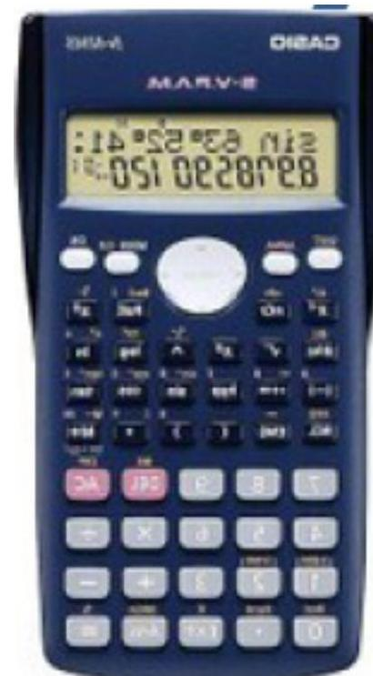
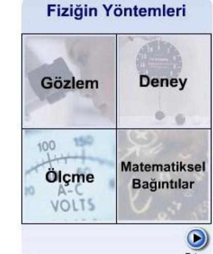
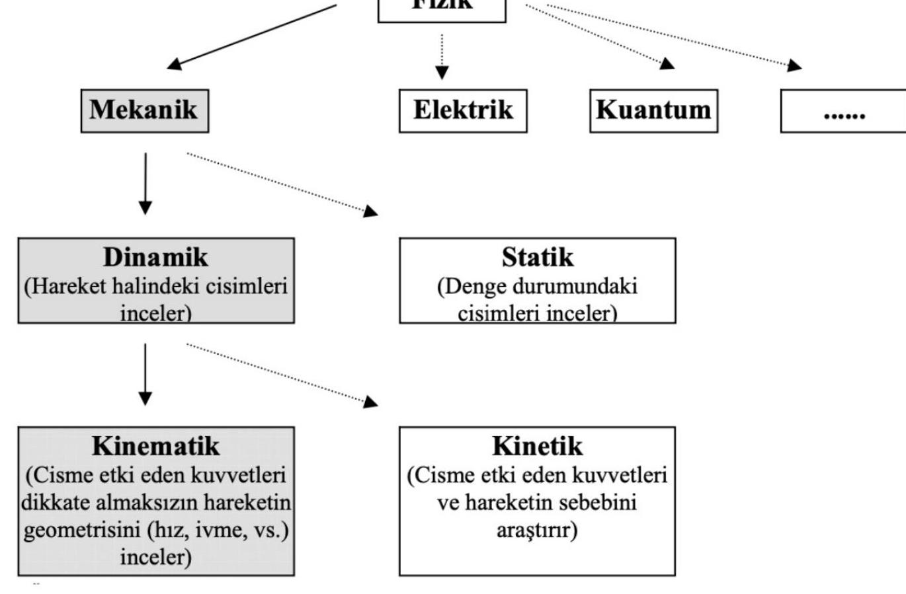
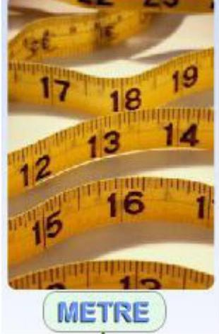
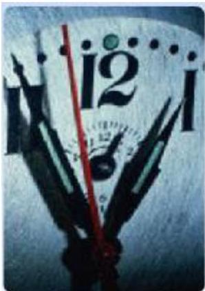
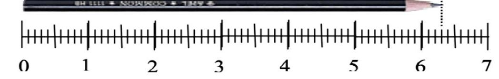
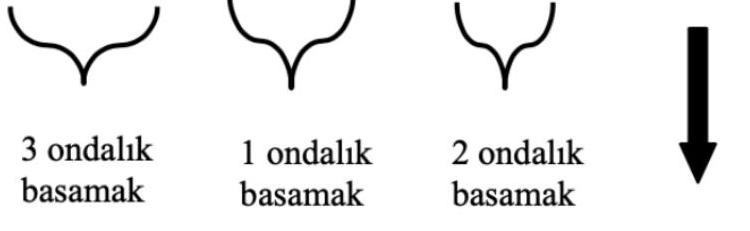

# FİZİK – 1 MEKANİK

## Dr. Öğr. Üyesi Emine Gürpınar Güler

**Dersin Kitabı:** *Physics for Scientists and Engineers* by R. A. Serway & J. W. Hewett

### DERSİN İÇERİĞİ

-   FİZİK VE ÖLÇME
-   BİR BOYUTTA HAREKET
-   VEKTÖRLER
-   İKİ BOYUTTA HAREKET
-   HAREKET KANUNLARI
-   DAİRESEL HAREKET VE NEWTON KANUNLARININ DİĞER UYGULAMALARI
-   İŞ VE KİNETİK ENERJİ
-   POTANSİYEL ENERJİ VE ENERJİNİN KORUNUMU
-   DOĞRUSAL MOMENTUM VE ÇARPIŞMALAR
-   KATI CİSMİN SABİT BİR EKSEN ETRAFINDA DÖNMESİ

# ÖNEMLİ! ÖĞRENCİLERİN DİKKATİNE

Problemlerin çözümleri için hesap makinesi temin etmeniz gerekmektedir. Derslerde ve sınavlarda hesap makinesi yanınızda olmak zorundadır. Hesap makinesi yerine cep telefonu kullanmak yasaktır.

# ÖNEMLİ! ÖĞRENCİLERİN DİKKATİNE Derslere Devam Hakkında

## 2024-2025 Eğitim ve Öğretim Yılı Lisans Akademik Takvim

T.C. KONYA TEKNİK ÜNİVERSİTESİ 2024 - 2025 EĞİTİM-ÖĞRETİM YILI ÖNLİSANS ve LİSANS AKADEMİK TAKVİMİ

### GÜZ YARIYILI

| Tarih                             | Etkinlik                                                        |
| :-------------------------------- | :-------------------------------------------------------------- |
| 23 Ağustos 2024                   | Özel Öğrenci Başvuruları İçin Son Gün                           |
| 26 Ağustos - 6 Eylül 2024        | Şartlı Ön koşullu ve seçmeli derslerin kontenjan bilgilerinin otomasyona girilmesi |
| 19 Ağustos-21 Ağustos 2024       | Üniversitemizi Yeni Kazananların e-Devlet Üzerinden Elektronik Kayıt Tarihleri |
| 19 Ağustos-23 Ağustos 2024       | Üniversitemizi Yeni Kazananların Yüz Yüze Kayıt Tarihleri       |
| 2 Eylül 2024                      | Yarıyıl Katkı Payı/ Öğrenim Ücreti Ödeme Süresi Başlangıcı      |
| 6 Eylül 2024                      | Danışmanlıkların Bölümlerce Belirlenmesinin Son Günü           |
| 9 - 12 Eylül 2024                 | Ders Kayıt İşlemleri                                            |
| 9 - 13 Eylül 2024                 | Danışman Kontrolü                                               |
| 16 Eylül - 27 Aralık 2024         | Ders Dönemi                                                     |
| 16 - 20 Eylül 2024                | Fakülteler ve Meslek Yüksekokulları İçin Ek Sınav (Final Sınavı) |
| 16 - 20 Eylül 2024                | Zorunlu Yabancı Dil Muafiyet İçin Başvuru Tarihi                |
| 17 - 18 Eylül 2024                | Ders Ekleme-Bırakma                                             |
| 25 Eylül 2024                     | Zorunlu Yabancı Dil Muafiyet Sınavı                             |
| 30 Eylül - 4 Ekim 2024            | Fakülteler ve Meslek Yüksekokulları İçin Ek Sınav (Bütünleme Sınavı) |
| 4 Ekim 2024                       | Mazeretli Geç Kayıtlar ve Kayıt Dondurma İçin Son Başvuru Tarihi |
| 4 - 10 Kasım 2024                 | Ara Sınav Dönemi                                                |
| 29 Aralık 2024                    | Ara Sınav Sonuçlarının OBIS'e Girilmesi                         |
| 30 Aralık 2024 - 10 Ocak 2025     | Genel Sınav Dönemi                                              |
| 18 Ocak 2025                      | Genel Sınav Sonuçlarının OBIS'e Girilmesi                       |
| 20 - 26 Ocak 2025                 | Bütünleme Sınavı Dönemi                                         |
| 30 Ocak 2025                      | Bütünleme Sınav Sonuçlarının OBIS'e Girilmesi                   |

Öğrenci, Fizik 1 derslerine devam etmek zorundadır. Derslerin %70'inden fazlasına devam etmeyen öğrenci sisteme devamsız olarak girilir ve dersin genel sınavına/bütünleme sınavına giremez.

# ÖNEMLİ! ÖĞRENCİLERİN DİKKATİNE Başarı Notunun Belirlenmesi Hakkında

Fizik 1 dersinin başarı notu, derse ait arasınav notu ve genel sınav/bütünleme sınavı ile belirlenir. Fizik 1 dersi ara sınavdan alınan puanın katkı yüzdesi %40 ve genel sınav/bütünleme sınavından alınan puanın katkı yüzdesi %60'tır. Öğrencinin bir dersten başarılı olabilmesi için genel sınav/bütünleme sınavından 100 tam puan üzerinden en az 35 puan alması gerekir.

| Not Aralığı | Harf Notu | Harf Notu Katsayısı |
| :---------- | :-------- | :------------------ |
| 82-100      | AA        | 4.00                |
| 74-81       | BA        | 3.50                |
| 65-73       | BB        | 3.00                |
| 58-64       | CB        | 2.50                |
| 50-57       | CC        | 2.00                |
| 40-49       | DC        | 1.50                |
| 35-39       | DD        | 1.00                |
| 25-34       | FD        | 0.50                |
| 0-24        | FF        | 0.00                |

Tablodaki harf notlarının açıklamaları şunlardır:
a) AA, BA, BB, CB ve CC: Başarılı
b) DC: Şartlı geçer. Mezun olmak için alması gereken bütün derslerden harf notu DC olanların sadece 6 tanesi başarılı sayılır.
c) DD, FD ve FF: Başarısız

Final notu < 35 (Öğrenci Bütünleme Sınavına girmek zorundadır.)

## ŞARTLI GEÇME DURUMU

Final sınavından sonra öğrenci notunu Öğrenci Bilgi Sisteminden (OBS) kontrol eder ve notu DC ise öğrenciye iki seçenek sunulur:
1. Şartlı geçmeyi Kabul ediyorum şıkkını işaretler. Bütünleme sınavına giriş hakkını kaybeder.
2. Şartlı geçmeyi Kabul etmiyorum şıkkını işaretler. Bütünleme sınavına girmek zorundadır. Artık final sınavında aldığı notu geçersizdir ve bütünleme sınavında alacağı notu geçerli olacaktır.

Bütünleme notu < 35 (KALDI)

Bütünleme Sınavı ≥ 35 ve Vize (%40) + Bütünleme (%60) ≥ 40 - 49 (DC şartlı geçer)
Bütünleme Sınavı ≥ 35 ve Vize (%40) + Bütünleme (%60) ≥ 50 (GEÇER)

# ÖNEMLİ! ÖĞRENCİLERİN DİKKATİNE

Bana ulaşmanız gerektiğinde egguler@ktun.edu.tr mail adresine mail gönderebilirsiniz.

Mailinizi gönderirken: Adınızı Soyadınızı, hangi bölümde olduğunuzu, öğretim durumu (A ve B şube) ve numaranızı yazmayı unutmayınız.

Ofis No: G312

# FİZİK - 1 MEKANİK (Fizik ve Ölçme)

Bu bölümde:
*   Fizik ve Fiziğin Yöntemleri
*   Fiziksel Nicelikler, Standartlar ve Birimler
*   Uluslararası Birim Sistemi (SI)
*   Uzunluk, Kütle ve Zaman Standartları
*   Boyut Analizi
*   Birim Çevirme

ile ilgili konular anlatılacaktır. Bu bölümü tamamladığımızda;
*   Fizik Biliminin tanımını ve yöntemlerini,
*   Fiziksel olayları açıklamak için gerekli olan fiziksel nicelikleri, standartları ve birimleri,
*   Uluslararası Birim Sistemini (SI),
*   Mekaniğin temel nicelikleri olan uzunluk, kütle ve zaman standartlarını,
*   Boyut kavramını ve birim çevirmeyi öğrenmiş olacaksınız.

# FİZİK – 1 MEKANİK (Fizik ve Ölçme)

## 1.1 Fizik ve Fiziğin Yöntemleri

Fizik doğa olaylarını ya doğrudan doğruya ya da onları basitleştirilmiş koşullar altında tekrarlayarak araştırır. Doğa olayları çoğu kez çok karışık koşullar altında meydana gelirler. Bu gibi hallerde fizikçi gözlem ve deney ile araştırma yöntemine başvurur. Olay ayrıntılarından arındırılır ve basit bir biçimde kontrol edilebilen koşullar altında yapay olarak tekrarlanır, yani bir deney yapılır. Deney, doğaya yöneltilen bir sorudur. Deneylerin sonucunda doğaya sorulan sorulara alınan yanıtlar bir araya getirilerek, doğa olayının açıklanması mümkün olur. O halde fiziğin yöntemleri gözlem, deney, ölçüm yapmak ve matematiksel bağıntılar kurmaktır.

Fizik araştırmalarının amacı sadece ve sadece öğrenmek ve doğanın sırlarına ulaşmaya, doğanın gerçeklerine yaklaşmaya çalışmaktır. Teorilerin geliştirilmesinde kullanılan kanunlar, deney ve teori arasında bir köprü görevi yapan matematik dili ile ifade edilir. Fizik biliminin buluşlarından faydalanmak ve buluşları pratik sonuçlara uygulamak, mühendislik bilim dallarının amaçları arasında yer alır.

Fiziğin Yöntemleri gözlem, deney, ölçüm yapmak ve matematiksel bağıntılar kurmaktır.

# FİZİK - 1 MEKANİK (Fizik ve Ölçme)

## Klasik Fizik ve Modern Fizik

### Klasik Fizik

1900 yılından önce geliştirilen teoriler, kavramlar, kanunlar, klasik mekanikteki deneyler, termodinamik ve elektromanyetizma anlaşılır. Klasik fizik üç temel dalı içine alır:
*   Klasik Mekanik
*   Termodinamik
*   Elektromanyetizma

Klasik mekanik ışık hızından çok daha küçük hızla hareket eden ve atomlara göre çok büyük olan cisimlerin hareketini inceler. En büyük katkıyı Isaac Newton (1642-1727) yapmıştır.

### Modern Fizik

19. yüzyılın sonlarına doğru başlayan ve klasik fiziğin açıklamakta eksik kaldığı fiziksel olayları açıklayan yeni teorileri kapsayan fizikteki yeni çağ. Modern fiziğin gelişmesinin temel nedeni klasik fiziğin birçok fiziksel olayı açıklayamayacağının ortaya çıkmasıdır. Modern fiziğe iki önemli gelişme damgasını vurmuştur:
*   Kuantum Mekaniği
*   Görecelik Kuramı

Kuantum mekaniği hem makroskopik hem de mikroskopik dünyaya uygulanabilir ve atomik seviyedeki fiziksel olayların tanımlanmasını sağlamak için bilim adamları tarafından formüle edilmiştir.

# FİZİK – 1 MEKANİK (Fizik ve Ölçme)

### Fizik

*   Mekanik
*   Elektrik
*   Kuantum
*   Dinamik (Hareket halindeki cisimleri inceler)
*   Statik (Denge durumundaki cisimleri inceler)
*   Kinematik (Cisme etki eden kuvvetleri dikkate almaksızın hareketin geometrisini (hız, ivme, vb.) inceler)
*   Kinetik (Cisme etki eden kuvvetleri ve hareketin sebebini araştırır)

Genel Fizik I dersi, klasik fiziğin mekanik ve termodinamik dallarına ilişkin temel konuları ve Genel Fizik II dersi ise elektromagnetizma, optik ve modern fizik dallarına ilişkin konuları içermektedir.

# FİZİK - 1 MEKANİK (Fizik ve Ölçme)

## 1.2 Fiziksel Nicelikler, Standartlar ve Birimler

Fizik, araştırdığı doğa olaylarına ait kanunları FIZIKSEL NICELIKLERLE anlatır. Çok sayıda olan bu niceliklerin bazıları şunlardır:
*   Kütle
*   Uzunluk
*   Zaman
*   Hız
*   İvme
*   Kuvvet
*   Sıcaklık
*   Enerji
*   Elektrik alan şiddeti
*   Manyetik akı

Bu fiziksel nicelikler tam ve kesin şekilde tanımlanmalıdır. Bir fiziksel niceliğin nasıl ölçüleceğinin bir kuralı ve bir birimi belirlenirse, o fiziksel nicelik tam olarak tanımlanmış olur ve böylece standardı elde edilir. Kolayca anlaşılacağı gibi, fiziksel nicelikler için standart tanımlama tamamen keyfidir. Ama standardın kullanışlı, yararlı ve herkes tarafından kabul edilebilir olması gerekir.

# FİZİK - 1 MEKANİK (Fizik ve Ölçme)

Çok sayıda fiziksel nicelik olduğunu söyledik. Doğal olarak bunlar birbirleriyle ilişkilidirler. Onun için fiziksel niceliklerin bir sistem içinde düzenlenmesi gerekir. Bu düzenlemede, bazı fiziksel nicelikler TEMEL FIZIKSEL NICELIKLER olarak seçilir ve geriye kalanlar temel fiziksel niceliklerden türetilir; bunlara da TÜRETILMIŞ FIZIKSEL NICELIKLER adı verilir. Türetilmiş niceliklerin tümünü en basit şekilde türetebilecek en az sayıda temel nicelik seçilir. Seçim, Uluslararası Ağırlık ve Ölçmeler Genel Konferansları'nda yapılır.

### 1.3 Uluslararası Birim Sistemi (SI)

1960 yılında toplanan Uluslararası Ağırlık ve Ölçmeler Genel Konferansı yedi niceliği temel nicelik olarak seçmiştir ve bu birim sistemine Uluslararası Birim Sistemi, kısaca (SI), adını vermiştir. Tablo 1'de, SI'daki temel fiziksel nicelikler, birimleri ve sembolleri verilmiştir. Tablo 1'de verilen SI temel fiziksel niceliklerinden türetilen SI türetilmiş fiziksel niceliklere bazı örnekler Tablo 2'de gösterilmiştir. Türetilmiş niceliklerin temel niceliklerden nasıl türetildiklerini ilerideki bölümlerde göreceğiz.

Uluslar arası Birim Sistemi (SI): Tüm bilim adamlarınca ve dünyanın neredeyse bütün ülkelerinde kullanılan uluslar arası olarak kabul edilmiş birim sistemidir.

# FİZİK - 1 MEKANİK (Fizik ve Ölçme)

## Tablo 1 - Temel Fiziksel Nicelikler

| BÜYÜKLÜK         | ADI       | SİMGESİ |
| :--------------- | :-------- | :------ |
| Uzunluk (l,x,s,h,r......) | Metre     | m       |
| Kütle (m)        | Kilogram  | kg      |
| Zaman (t)        | Saniye    | sn      |
| Elektrik Akımı (i) | Amper     | A       |
| Termodinamik Sıcaklık (T) | Kelvin    | K       |
| Madde Miktarı (n) | Mol (mole)| mol     |
| Işık Şiddeti (I) | Kandela (candela) | cd      |

# FİZİK - 1 MEKANIK (Fizik ve Ölçme)

## Tablo 2 - Türetilmiş Fiziksel Nicelikler

| BÜYÜKLÜK             | ADI           | SİMGESİ                        |
| :------------------- | :------------ | :----------------------------- |
| Magnetik akı ( $\varnothing$ ) | Weber         | Wb                             |
| Magnetik akı yoğunluğu (B) | Tesla         | T                              |
| Işık akısı ( $\Phi$ )    | lümen         | Im                             |
| Aydınlatma (E)       | lüks          | lx                             |
| Elektrik yükü (q,Q)  | Coulomb       | C                              |
| Elektrik gerilimi (V) | Volt          | V                              |
| Elektrik direnci (R) | Ohm           | $\Omega$                       |
| Elektrik sığası (C)  | Farad         | F                              |
| İndüktans (L)        | Henry         | H                              |
| Güç (P)              | Watt          | W                              |
| Enerji ($\mathrm{E}_{\mathrm{k}}, \mathrm{E}_{\mathrm{p}}, \mathrm{W}$) | Joule         | J                              |
| Frekans (f)          | Hertz         | $\mathrm{Hz}\left(\mathrm{sn}^{-1}\right)$ |
| Kuvvet (F)           | Newton        | N                              |
| Basınç             | Pascal        | Pa                             |

# FİZİK - 1 MEKANİK (Fizik ve Ölçme)

SI birimleri cinsinden, çok büyük veya çok küçük sayılarla ifade edilen fiziksel niceliklerin değerlerini 1'e yakın bir sayı ile büyük birim veya küçük birim cinsinden yazmak kolaylık sağlar. Örneğin dünyanın yarıçapı yaklaşık 6.400.000 metredir. Bu değer, $6,4 \times 10^{6} \mathrm{~m}=6,4 \mathrm{Mm}$ (megametre) şeklinde yazılır. Hidrojen atomunun yarıçapı 0,00000000005 metredir. Bu değer de $5 \times 10^{-11} \mathrm{~m}=50 \times 10^{-12} \mathrm{~m}=50 \mathrm{pm}$ (pikometre) şeklinde yazılır. Burada kullanılan mega ve piko gibi önekler 10'un kuvvetleri olan $10^{6}$ ve $10^{-12}$ nin adlarıdır. SI'nin üst ve alt katları Tablo 3'de verilir.

| 10'un kuvveti | Önek  | Sembol | 10'un kuvveti | Önek  | Sembol |
| :------------ | :---- | :----- | :------------ | :---- | :----- |
| $10^{18}$     | Eksa  | E      | $10^{-1}$     | Desi  | d      |
| $10^{15}$     | Peta  | P      | $10^{-2}$     | Santi | c      |
| $10^{12}$     | Tera  | T      | $10^{-3}$     | Mili  | m      |
| $10^{9}$      | Giga  | G      | $10^{-6}$     | Mikro | µ      |
| $10^{6}$      | Mega  | M      | $10^{-9}$     | Nano  | n      |
| $10^{3}$      | Kilo  | k      | $10^{-12}$    | Piko  | p      |
| $10^{2}$      | Hekto | h      | $10^{-15}$    | Femto | f      |
| $10^{1}$      | Deka  | Da     | $10^{-18}$    | Atto  | a      |

# FİZİK - 1 MEKANİK (Fizik ve Ölçme)

Tablo 1'de verilen SI temel fiziksel niceliklerinden uzunluk, kütle ve zaman mekanik dalı için yeterlidir. Bundan sonraki kısımda bunlara ait standartların tanımları verilecektir. Diğer temel fiziksel niceliklere ait standartlar daha sonraki bölümlerde tanımlanacaktır. Genel Fizik I ve Genel Fizik II derslerimizde, SI birim sistemi kullanılacaktır. Başka birim sistemlerinin olduğunu da unutmamak gerekir.

### 1.4 Uzunluk, Kütle ve Zaman Standartları

İlk uzunluk standardı, metre, 1792 yılında Paris'ten geçen boylam üzerinde kuzey kutbundan ekvatora kadar olan mesafenin on milyonda biri olarak tanımlandı. Daha sonra, platin-iridyum alaşımından yapılmış özel bir çubuk "standart metre" olarak kabul edildi ve 1960 yılına kadar kullanıldı. Bu standart, yok olma olasılığı ve gelişen teknolojinin gerektirdiği duyarlılığı karşılayamaması gibi nedenlerle terk edildi.

1960 yılında standart metre, ışığın dalga boyu cinsinden çok hassas bir şekilde tanımlandı. Bu tanıma göre, bir metre, kripton atomunun uyarılması sonucu yaydığı karakteristik turuncu-kırmızı ışığın dalga boyunun 1.650.763,73 katıdır. Son olarak, 1983 yılında "1 METRE", ışığın boşlukta 1/299.792.458 saniyede aldığı yolun uzunluğu olarak tanımlanmıştır. Metrenin tanımı saniye tanımına ve ışığın boşluktaki hızının büyüklüğünün 299.792.458 m/s olduğunun kabul edilmesine bağlıdır.

# FİZİK - 1 MEKANİK (Fizik ve Ölçme)

1887 yılında kabul edilen kütle standardı, "1 KİLOGRAM", platin-iridyum alaşımından yapılmış silindirin kütlesi olarak tanımlanır. Standart metre çubuğu ile birlikte bu silindir Fransa'nın Sevres kentindeki Uluslararası Ağırlık ve Ölçümler Bürosu'nda saklanır. Bunların benzerleri her ülkenin kendi ulusal standartlar bürosunda bulunur.

2019 yılında bu tanım da değişerek bir maddeye değil de teorik bir sabite bağlanmıştır. 2019 yılında, kilogramın tanımı, Planck sabiti kullanılarak yeniden tanımlandı. Bu tanımda, bir kilogram, Planck sabitinin belirli bir sayı değerine eşit olan bir kavramsal ölçü birimi haline geldi. Yani, kilogram artık, Planck sabitinin tam olarak $6,626 \times 10^{-34}$ joule saniye olduğu sabit bir sayı ile ifade edilen bir kavramsal ölçü birimi olarak tanımlanıyor. Bu, kilogramın daha önceki tanımından farklı olarak, belirli bir fiziksel nesneye dayalı olmayan ve tamamen doğal sabitlerle ilişkili olan bir tanım olduğu anlamına gelir.
Kilogramın yeni tanımı şu şekildedir: "Kilogram, Planck sabiti değeri h olarak belirlenmiş olan bir sabit sayıdır ve c ışık hızı sabiti tam olarak 299.792.458 m/s değerine eşittir." Bu tanım, kilogramın artık bir fiziksel nesne olan Uluslararası Kilogram Prototipi'ne dayanmadığı, doğrudan doğruya doğal sabitlere bağlı olarak tanımlandığı anlamına gelir.
Bu yeni tanımın avantajı, Planck sabiti ve ışık hızı sabiti değerlerinin, dünya genelindeki laboratuvarlarda aynı olduğu için, kilogramın tüm dünya çapında daha kesin ve tutarlı bir ölçü birimi haline gelmesidir.

# FİZİK - 1 MEKANİK (Fizik ve Ölçme)

Zaman standardı saniyedir. 1960 yılına kadar saniye ortalama güneş günü cinsinden tanımlanmıştır. Bir güneş günü, güneşin gökyüzünde ulaştığı en yüksek noktadan art arda iki geçişi arasındaki zaman aralığına denir, bir güneş gününün $\left(\frac{1}{60}\right)\left(\frac{1}{60}\right)\left(\frac{1}{24}\right)=\frac{1}{86400}$'üne saniye adı verilir. 1967 yılında yeni saniye standardı yok edilemez ve kolayca elde edilebilir niteliklerine sahip oldu. "1 SANIYE", sezyum atomunun 9.192.631.770 defa titreşim yapması için geçen zamandır.

# FİZİK – 1 MEKANİK (Fizik ve Ölçme)

**METRE**: Uzunluk standartıdır, ışığın boşlukta 1/299.792.458 saniyede aldığı yolun uzunluğu olarak tanımlanmıştır.

**KİLOGRAM**: Kütle standartıdır. 20 Mayıs 2019'da yürürlüğe giren yeni bir tanım kabul edildi. Yeni tanım, Planck sabitinin değerine dayanmaktadır. Yeni tanıma göre kilogram, Planck sabitinin (h) tam olarak $662.607.015 \times 10^{-34}$ Joule.saniye (J.s) değerine sahip olduğu bir tanımla belirlenmiştir.

**SANIYE**: Zaman standartıdır, Sezyum atomunun 9.192.631.770 defa titreşim yapması için geçen zaman olarak tanımlanmıştır.

# FİZİK - 1 MEKANİK (Fizik ve Ölçme)

### 1.5 Boyut Analizi

Boyut, bir fiziksel niceliğin doğasını belirler. Mekaniğin temel nicelikleri olan uzunluğu, kütleyi ve zamanı belirtmek için sırasıyla L, M ve T sembolleri kullanılır. C bir fiziksel nicelik ise, boyutu [C] sembolü ile gösterilir.

| Nicelikler | Boyut Sembolü |
| :--------- | :------------ |
| Uzunluk    | L             |
| Kütle      | M             |
| Zaman      | T             |

Bir eşitliği türetmek veya kontrol etmek durumunda kaldığımız zaman, boyut analizi bize yardımcı olacaktır.

## Bazı Niceliklerin Boyutları

| Nicelikler          | Boyut Sembolü              |
| :------------------ | :------------------------- |
| Yüzölçüm veya Alan (A) | $[\mathrm{A}]=\mathrm{L}^{2}$ |
| Hacim (V)           | $[\mathrm{V}]=\mathrm{L}^{3}$ |
| Hız (v)             | $[\mathrm{v}]=\mathrm{L} / \mathrm{T}$ |
| İvme (a)            | $[\mathrm{a}]=\mathrm{L} / \mathrm{T}^{2}$ |
| Yoğunluk (p)        | $[\mathrm{p}]=\mathrm{M} / \mathrm{L}^{3}$ |
| Kuvvet (F)          | $[\mathrm{F}]=\mathrm{ML} / \mathrm{T}^{2}$ |

# FİZİK - 1 MEKANİK (Fizik ve Ölçme)

Boyut analizi, fizikteki işlemleri çözerken son derece faydalı ve etkili bir işlemdir. Her zaman kullanılabilir ve denklemlerin ezberlenmesini en aza indirilmesine de yardımcı olur. Nicelikler sadece aynı boyuta sahipseler toplanabilir veya çıkarılabilirler. Bir eşitliğin iki tarafındaki ifadeler aynı boyuta sahip olmak zorundadır. Bu basit kurallar uygulanırsa, boyut analizi kullanarak eşitliğin doğru bir şekilde yazılıp yazılmadığı saptamak kolay olur çünkü ifadedeki ilişkiler, ancak ve ancak denklemin iki tarafındaki boyutlar aynı ise doğru olabilir.

Boyut analizinin bir diğer örneği olarak yol formülünü inceleyelim. Bir cisim x doğrultusu boyunca başlangıç noktasından $v_0$ ilk hızıyla harekete başlıyor ve a sabit ivmesiyle $t$ zamanında $x$ kadar yol alıyorsa, $x$ yolu için aşağıdaki eşitlik yazılır:

$$
x = v_0 t + \frac{1}{2} a t^2
$$

Boyut analizine göre:

$$
[L] = \frac{[L]}{[T]}[T] + \frac{[L]}{[T]^2}[T]^2 \quad \Rightarrow \quad L = L + L
$$

Bulunur, yani eşitlikteki üç terim de uzunluk boyutuna sahiptir. Dolayısıyla verilen eşitlik doğrudur.

# FİZİK - 1 MEKANİK (Fizik ve Ölçme)

## Örnek 1:

$v = at$ ifadesinin boyutsal olarak doğru olduğunu gösteriniz. Burada $v$ hızı, $a$ ivmeyi, $t$ ise zamanı göstermektedir. Bu ifade $v = at^2$ olarak verilseydi, boyutsal olarak doğru olur muydu?

# FİZİK - 1 MEKANİK (Fizik ve Ölçme)

## Örnek 2:

Düzgün $v$ hızı ile $r$ yarıçaplı bir dairede hareket eden parçacığın ivmesi, $r^n$ ve $v^m$ ile orantılı olduğu varsayılıyor. $n$ ve $m$'yi belirleyiniz.

# FİZİK - 1 MEKANİK (Fizik ve Ölçme)

### 1.6 Birim Çevirme

Fiziksel nicelikler için standart seçiminin serbest olabileceğini ifade etmiştik. Bundan dolayı, örneğin bir su tankının hacmi 10.000 litre olarak verilebilir ve bu hacmin $\mathrm{m}^3$ cinsinden ne olduğu sorulabilir. İşte bu durumda birim çevirme işlemi yapmamız gerekir. Bu soruya cevap verebilmek için 1 litre $= 1 \mathrm{dm}^3 = 10^{-3} \mathrm{~m}^3$ olduğunu bilerek, 10.000 litre $= 10^4 \cdot 10^{-3} \mathrm{~m}^3 = 10 \mathrm{~m}^3$ şeklinde birim çevirme işlemini tamamlarız.

# FİZİK - 1 MEKANİK (Fizik ve Ölçme)

### 1.7 Ölçüm, Ölçüm Hataları ve Anlamlı Rakamlar

Ölçüm, her deneysel bilimin temelini oluşturur. Fizik biliminde de teorilerin sınanması için çeşitli deneyler tasarlanır ve bu deneyler sırasında çok çeşitli ölçümler yapılır.

Ölçüm yaparken üzerinde önemle durulması gereken iki kavram doğruluk ve duyarlılıktır. Doğruluk, fiziksel bir niceliğin bir ölçümünün doğru (gerçek) değere ne kadar yakın olduğunu gösterir. Duyarlılık, aynı büyüklüğün ölçülmesinden elde edilen iki değerin birbirine ne kadar yakın olduğunu gösterir.

Ölçümler sonucu elde edilen sayısal değerler, ancak ölçüm hataları ile birlikte verildikçe anlamlı olur. Örneğin fiziksel bir $x$-niceliğinin (uzunluk, zaman, gerilim, elektrik akımı,...vb) bir $x_1$ ölçümünü yapalım. $x_1$ ölçümünün sonucu $x$-niceliğinin değeri belli bir yaklaşıklıkla elde edilecektir. İkinci bir $x_2$ ölçümü yaparsak, bunun sonucunun $x_1$ ölçümünün sonucundan biraz farklılaştığını görürüz. Çok sayıda ölçüm alırsak her bir ölçüm için farklı değer elde ederiz. Buna göre x-niceliğinin değerini tam olarak belirlemeyi bekleyemeyiz. Bunun yerine çok sayıda ölçüm alarak, ölçüm sonuçlarının nasıl bir dağılım gösterdiğine ve en çok hangi değer etrafında toplandığına bakabiliriz.

## Ölçülen Değer = En İyi Tahmin $\pm$ Hata (Orta veya Ortalama Değer)

Burada en iyi tahmin dediğimiz şey, ölçümlerin toplandığı sayısal değerdir.

# FİZİK - 1 MEKANİK (Fizik ve Ölçme)

Hiçbir fiziksel ölçüm hatasız değildir. Burada hatadan kasıt, "yanlış" ya da "kusur" değil, "belirsizlik"tir. Kullandığımız ölçü aletinin duyarlılığı, izlenilen deneysel yöntem ve deneyi yapan kişinin dikkat ve becerisi ile ölçümlerimiz belli bir hata sınırı içerisindedir. Örneğin mm bölmeli bir cetvel ile bir kurşun kalemin boyunu $6,3 \mathrm{~cm}$ olarak ölçebiliriz. Ancak kullandığımız ölçü aletinin duyarlılığından dolayı kalemin boyunu ölçerken virgülden sonraki ikinci basamağın ne olduğunu bilemeyiz. $6,30 \mathrm{~cm}$? $6,45 \mathrm{~cm}$? Bunun için kompas gibi daha duyarlı ölçüm yapan bir ölçüm aleti kullanmamız gerekir.

Ölçümlerdeki hataları;
1.  **Sistematik Hatalar**
2.  **İstatistiksel (Rastgele) Hatalar** olmak üzere iki kısımda inceliyoruz.

### Sistematik Hatalar

Bu tip hatalar, kullanılan ölçüm aletlerinden, kişisel yetersizliklerden, deneyde izlenilen metottan ve dış etkilerden kaynaklanır. Bu tip hatalar sonucu hep tek yönde etkiler. Sistematik hataları, deney yöntemini değiştirerek, daha hassas ölçü aletleri kullanarak ya da deney sonunda gerekli düzeltmeleri yaparak ortadan kaldırabiliriz.

### İstatistiksel (Rastgele) Hatalar

Ölçme duyarlılığının doğal olarak sınırlı oluşundan kaynaklanan hatalardır. Bu hatalar sonucu çift yönlü etkiler. Daha fazla sayıda ölçüm alarak istatistiksel hataları azaltabiliriz.

# FİZİK - 1 MEKANİK (Fizik ve Ölçme)

## Anlamlı Rakamlar

Bir ölçümün duyarlılığı, ölçümü ifade eden rakam sayısı ile belirlenir. Yapılan bir ölçümü belirtmede kullanılan rakamlara anlamlı rakamlar denir. Anlamlı rakamlar kesinlikle bilinen rakamlarla birlikte şüpheli bir rakam daha içerir. Aksi belirtilmedikçe, en son rakamın şüpheli olduğu (bu rakamda belirsizlik olduğu) kabul edilir. Örneğin; bir kitabın kalınlığının 2.53 cm olduğu söyleniyorsa burada üçüncü rakam belirsizlik taşır (şüphelidir). Buradaki belirsizliğin 0.01 cm olduğu söylenir.

Anlamlı rakam sayısı şu kurallarla belirlenebilir:

1.  Ondalıklı sayılarda virgülün yerini belirtmek için kullanılan sıfırlar anlamlı değildir. Örneğin, $0,032 \mathrm{~m}$ olarak verilen bir ölçüm sonucunun anlamlı rakam sayısı ikidir. Aynı sonuç 32 cm olarak verilseydi, anlamlı rakam sayısı yine iki olurdu. Dolayısıyla ölçümün duyarlılığı birimleri değiştirmekle artırılamaz.
2.  Ölçüm sonucunun bir parçası olan sıfırlar anlamlıdır. Örneğin, 0,0040201 sayısının anlamlı rakam sayısı beştir.

# FİZİK - 1 MEKANİK (Fizik ve Ölçme)

3.  4000 sayısı gibi sıfırlar içeren bir sayının anlamlı rakam sayısını bulmak için bilimsel gösterim kullanmak daha kullanışlı olur. Bilimsel gösterimde bu sayıyı 10'un kuvvetleri cinsinden yazarız.
    *   $4 \times 10^3$ (1 anlamlı rakam)
    *   $4,0 \times 10^3$ (2 anlamlı rakam)
    *   $4,00 \times 10^3$ (3 anlamlı rakam)
4.  Bir ölçümün sonucu istenilen anlamlı rakam sayısından daha çok rakam içerebilir. Böyle bir durumda gereken anlamlı rakam sayısının bulunması için şunlar yapılır:
    *   Kalması istenen son rakamdan sonra gelen rakam 5'ten küçük ise son rakam aynen bırakılır. Örneğin 2,731 sayısının üç anlamlı rakamla yazılışı 2,73'tür.
    *   Eğer kalması istenen son rakamdan sonraki rakam 5 ve 5'ten büyük ise son rakam 1 artırılır. Örneğin, 8,6547 sayısının 4 anlamlı rakamla yazılışı 8,655'tir.

# FİZİK - 1 MEKANİK (Fizik ve Ölçme)

## Anlamlı Sayılarda Çarpma ve Bölme İşlemi:

Çarpma ve bölme işleminin sonucunun anlamlı rakam sayısı, en az anlamlı rakama sahip olan sayının anlamlı rakam sayısı ile belirlenir. Örneğin:

$(0.745 \times 2.2) / (3.885) = 0,42187021$ Bu sonuç 0.42 olarak verilir.

İşleminin sonucu 2 anlamlı rakamla verilmelidir. Çünkü işleme giren sayılar içinde en az anlamlı rakama sahip olan sayı 2.2'dir ve anlamlı rakam sayısı ikidir.

# FİZİK – 1 MEKANİK (Fizik ve Ölçme)

## Anlamlı Sayılarda Toplama ve Çıkarma İşlemi

Toplama ve çıkarma işleminin sonucu en az ondalık basamağa sahip sayıya göre belirlenir. Örneğin:

$27,153 + 138,2 - 11,74 = 153,613$

Sonuç tek ondalık basamak içermeli: **153.6**

# FİZİK - 1 MEKANİK (Fizik ve Ölçme)

## Bölüm Özeti

*   Fizik, doğa olaylarını gözlem ve deney yaparak formüle etmeye çalışır.
*   Fiziksel olayları tasvir etmek için temel ve türetilmiş nicelikler seçilir. Bunların standartları ve birimleri tanımlanır.
*   Uluslararası Birim Sistemi (SI) son zamanlarda benimsenmiş bir birim sistemidir. Genel Fizik I ve Genel Fizik II derslerimizde bu sistemi kullanarak problemlerimizi çözeceğiz.
*   Uzunluk [metre (m)], kütle [kilogram (kg)] ve zaman [saniye (s)] nicelikleri mekanik dalının SI'deki temel nicelikleridir.
*   Ölçümler sonucu elde edilen sayısal değerler, ancak ölçüm hataları ile birlikte verildikçe anlamlı olur.
*   Bir ölçümün duyarlılığı, ölçümü ifade eden rakam sayısı ile belirlenir. Yapılan bir ölçümü belirtmede kullanılan rakamlar anlamlı rakamlardir.

# PROBLEM ÇÖZÜMLERİNDE KULLANILACAK BAZI İŞLEMLERLE İLGİLİ KISA BİLGİLER

$$
\begin{gathered}
(2 \times 10^{-8}) \times (5 \times 10^{-8}) = 10 \times 10^{-16} = 10^{-15} \\
(2 \times 10^{-8}) \times (22 \times 10^{-10}) = (2 \times 22) \times (10^{-8} \times 10^{-10}) = 44 \times 10^{-18} = 4,4 \times 10^{-17} \\
5^7 \cdot 5^7 = 5^{7+7} = 5^{14} \\
10^{-8} \cdot 10^{-8} = 10^{-16} = \frac{1}{10^{16}} \\
\frac{1}{10^{-8}} = 10^8 \quad \frac{10^{-7}}{10^{-10}} = 10^{-7} \times 10^{10} = 10^3 \\
6,500,000,000 = 6,5 \times 10^9 \quad 0,00007 = 7 \times 10^{-5} \quad 0,000075 = 7,5 \times 10^{-5} \\
45 \times 10^7 + 5 \times 10^{10} = 45 \times 10^7 + 5 \times 10^3 \times 10^7 = 45 \times 10^7 + 5000 \times 10^7 = 5045 \times 10^7 = 5,045 \times 10^{10}
\end{gathered}
$$

# SI ULUSLARARASI BİRİMLER SİSTEMİ

## ÖRNEKLER

| Birim Adı                 | Birim Sembolü | İlişkilendirme                   |
| :------------------------ | :------------ | :------------------------------- |
| Direnç Birimi Ohm (Ω)     | KiloOhm (kΩ)  | $10^3$ Ohm (Ω)                   |
|                           | MegaOhm (MΩ)  | $10^6$ Ohm (Ω)                   |
| Sığa Birimi Farad (F)   | MikroFarad (µF) | $10^{-6}$ Farad (F)              |
|                           | PicoFarad (pF) | $10^{-12}$ Farad (F)             |
| Uzunluk Birimi Metre (m) | MikroMetre (µm) | $10^{-6}$ Metre (m)              |
|                           | SantiMetre (cm) | $10^{-2}$ Metre (m)              |

## Birbirinin ondalık katı olmayan birimlerden bazıları:

*   1 Saat (h) = 60 dakika (dak) = 3600 Saniye (sn)
*   1 J (Joule) = 1 / 4,186 Cal (Kalori)
*   1 kWh (Kilowatt-Saat) = 3.600.000 J

# Bölümle İlgili Sorular

## Soru 1:

Sabit ivme ile hareket eden bir parçacığın yerdeğiştirmesi, zaman ve ivmenin bir fonksiyonudur. Yerdeğiştirmenin $s=k a^m t^n$ ile ifade edildiği varsayılıyor. Burada $k$ boyutsuz bir sabittir. $m=1$ ve $n=2$ olduğunda bu ifadenin sağlandığını boyut analiziyle gösteriniz.

## Soru 2:

Bir basit sarkacın $T$ periyodu zaman birimidir ve $T=2\pi\sqrt{\frac{l}{g}}$ olarak verilmiştir. Burada $l$ sarkacın uzunluğu, $g$ yerçekimi ivmesidir. $g$'nin uzunluk biriminin zamanın karesine bölündüğünde elde edilen birime sahiptir. Bu eşitliğin boyutsal olarak tutarlı olduğunu gösteriniz.

# Soru 3:

Aşağıdaki eşitliklerin hangisi boyutsal olarak doğrudur?
a) $v = v_0 + ax$
b) $y = (2m) \cos(kx)$; burada $k=2 m^{-1}$ dir.

## Soru 4:

Newton'un evrensel çekim kanunu $F = \frac{G M m}{r^2}$ ile verilir. Burada $F$ çekim kuvvetini, $M$ ve $m$ kütleleri, $r$ ise iki kütle arasındaki uzaklığı göstermektedir. Kuvvet kg.m/s² birimine sahiptir. SI birim sisteminde orantılılık sabiti $G$'nin birimi nedir?