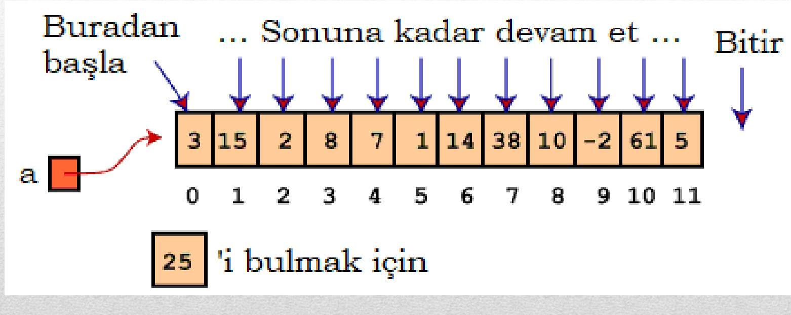
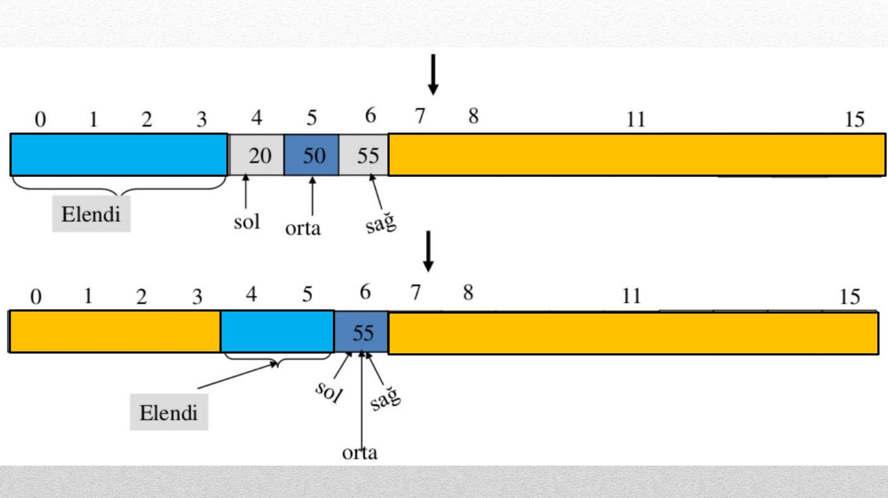

# BILGISAYAR PROGRAMLAMA 1

## Ders Notu 8 - Siralama ve Arama

Konya Teknik Üniversitesi
Elektrik - Elektronik Mühendisliği Bölümü
18.04.2024

Konya

Diziler ve matrislerin temel kullanım nedeni sıralama ve arama gibi bazı problemlere değişkenlere göre çok daha basit çözüm sağlamalarıdır. Bir dizinin kaç tane elemandan oluştuğu önemli olmamakla birlikte bu işlemler kolaylikla yapılabilmektedir.

Öte yandan örneğin bir sayı dizisinin sıralanması işleminde sıralanacak sayılar bir dizi üzerinde değil de farklı değişkenler üzerinde tutuluyor ise işlem karmaşıklaşacak hatta belki imkansız duruma dönüşecektir.

# Dizilerde Arama ve Sıralama

- Arama ve sıralama algoritmaları programlama ve yazılım geliştirme dünyasında hem akademik hem de endüstri açısından önemli bir yere sahiptirler.
- Özellikle büyük veri kaynakları ile çalışırken, aradığınız veriye en hızlı şekilde ulaşmanız doğru algoritmayı kullanmanıza bağlıdır.

# Dizilerde Arama

- Dizinin belirli bir elemanını bulma sürecine arama denir.
- Arama yapılırken, bir dizinin belirli bir arama değerine eşit olan bir değer içerip içermediğine bakılır.
- iki farklı arama tekniği üzerinde durulacaktır:
  - Doğrusal Arama (Linear / Sequential Search)
  - İkili Arama (Binary Search)

# Doğrusal Arama

- Sıralı/sıralı olmayan bir dizinin ilk elemanından başlanarak dizinin her elemanı, arama değeriyle karşılaştırılır.
- Aranan değer bulunduğunda ilgili dizi elemanının indisi değer olarak döndürülür.
- Dizi elemanları herhangi bir şekilde sıralı bulunmadığından değer ilk ya da son elemanda bulunabilir.
- Dolayısıyla, program ortalama olarak, arama değeriyle dizinin elemanlarının yarısını karşılaştırabilir.

# Doğrusal Arama



| 3   | 15  | 2   | 8   | 7   | 1   | 14  | 38  | 10  | -2  | 61  | 5   |
| --- | --- | --- | --- | --- | --- | --- | --- | --- | --- | --- | --- |
|     |     |     |     |     |     |     |     |     |     |     |     |

```c
#include <stdio.h>

int main() {
    int aranan, i, bulundu=0;
    int dizi[12]={3, 15, 2, 8, 7, 1, 14, 38, 10, -2, 61, 5};
    printf("Dizi icinde aramak istediginiz sayiyi giriniz:\n");
    scanf ("%d", &aranan);
    for(i=0; i<12; i++) {
        if(dizi[i]==aranan) {
            bulundu = 1;
            break;
        }
    }
    if(bulundu) /* if(bulundu==1) */
        printf("Aranan sayi, dizinin %d.elemanidir.", i+1);
    else
        printf("Aranan eleman bu dizide yoktur.\n");
    return 0;
}
```

# İkili Arama

Arama yapılacak dizinin sıralı bir dizi olması gerekir. Sıralı değilse, ikili arama yapabilmek için öncelikle dizinin herhangi bir sıralama algoritması ile sıralanması gerekir.

Bu teknikteki her bir adımda, aranan değerin, dizinin orta değerine eşit olup olmadığı kontrol edilir.

- Eşit olmaması durumunda aranan değerin orta değer tarafından ikiye ayrılan kısımlardan hangisinde olduğu kontrol edilir.
- Aranan değeri içeren kısım bir sonraki adımda arama yapılacak dizi olur ve bu sayede arama yapılan listedeki eleman sayısı her adımda yarıya düşer.

# ÖRNEK: Aşağıdaki dizide 55 sayısını arayalım.

| 0   | 1   | 2   | 3   | 4   | 5   | 6   | 7   | 8   | 9   | 10  | 11  | 12  | 13  | 14  | 15  |
| --- | --- | --- | --- | --- | --- | --- | --- | --- | --- | --- | --- | --- | --- | --- | --- |
| 3   | 8   | 10  | 11  | 20  | 50  | 55  | 60  | 65  | 70  | 72  | 90  | 91  | 94  | 96  | 99  |

| 0   | 1   | 2   | 3   | 4   | 7   | 8   | 11  | 15   |
| --- | --- | --- | --- | --- | --- | --- | --- | ---- |
| 3   | 8   | 10  | 11  | 20  | 50  | 55  | 60  | 65   |
| sol |     |     |     |     |     |     |     | orta |

| 0   | 1   | 2   | 3   | 4   | 6   | 7   | 8   | 11  | 15  |
| --- | --- | --- | --- | --- | --- | --- | --- | --- | --- |
| 3   | 8   | 10  | 11  | 20  | 50  | 55  |     |     |     |

| sol | orta | sağ | Elendi |
| --- | ---- | --- | ------ |
|     |      |     |        |



```c
#include <stdio.h>
#include <math.h>

int main() {
    int array[16] = {3,8,10,11,20,50,55,60,65,70,72,90,91,94,96,99};
    double sol = 0;
    double sag = 15;
    int flag = 0;
    int indis = 0;
    int s;
    printf("Dizi icinde aramak istediginiz sayiyi giriniz:\n");
    scanf ("%d", &s);
    while(sol <= sag){
        indis = ceil(sol+(sag-sol)/2);
        printf("indis: %d \n",indis);
        if(array[indis] == s){
            flag = 1;
            printf("Bulundu: %d \n",indis);
            break;
        }
        else if(array[indis] < s){
            sol = indis+1;
        }
        else{
            sag = indis-1;
        }
    }
    if(flag == 0){
        printf("Bulunamadi!\n");
    }
    return 0;
}
```

# Dizilerde Sıralama

Diziler üzerinde yapılan işlemlerde döngülere en çok ihtiyaç duyulan işlemlerden biri de sıralama işlemidir.

Siralama algoritmalarında genellikle dizinin elemanlarını gezmek için bir döngü ve bu döngünün her iterasyonunda da dizinin ilgili elemanlarını karşılaştırmak ya da yer değiştirmek için ikinci bir döngü kullanılır.

Ders kapsamında, sıralama algoritmalarından kabarcık sıralama (bubble sort) ve hızlı sıralama (quick sort) algoritmaları üzerinde durulacaktır.

# Kabarcık Siralama

Kabarcık denmesinin sebebi bu algoritmada en büyük sayının en sona atılmasıdır. Her iterasyonda en büyük sayı en sona atılır ve iterasyonlar tamamlandığında sıralama gerçekleşmiş olur.

Her adımda dizinin ardışık iki elemanını karşılaştırır. Eğer ilk eleman ikinci elemandan büyükse yer değiştirme yapılır. Her iterasyonda en büyük sayı sona gelir, iterasyonlar tamamlandığında algoritma tamamlanmış olur.

| 8   | 7   | 1   | 14  | 38  |
| --- | --- | --- | --- | --- |
|     |     |     |     |     |
| 7   | 8   | 1   | 14  | 38  |
|     |     |     |     |     |
| 7   | 1   | 8   | 14  | 38  |
|     |     |     |     |     |
| 7   | 1   | 8   | 14  | 38  |
|     |     |     |     |     |
| 7   | 1   | 8   | 14  | 38  |

| 7   | 1   | 8   | 14  | 38  |
| --- | --- | --- | --- | --- |
|     |     |     |     |     |
| 1   | 7   | 8   | 14  | 38  |
|     |     |     |     |     |
| 1   | 7   | 8   | 14  | 38  |
|     |     |     |     |     |
| 1   | 7   | 8   | 14  | 38  |
|     |     |     |     |     |
| 1   | 7   | 8   | 14  | 38  |

```c
#include <stdio.h>
#include <stdlib.h>

/* Kabarcik Sıralama (Bubble Sort) */
int main(){
    int son, gecici;
    int dizi[100];
    int i,j;
    printf("Girilecek sayi adedi:\n ");
    scanf("%d", &son);
    for(i=0; i<son; i++){
        printf("%d. Sayiyi giriniz: ", i+1);
        scanf("%d", &dizi[i]); }
    for(i=0; i<son; i++)
        printf("%d ", dizi[i]);
    printf("\n\n");

    for(i=0; i<son; i++){
        for(j=0; j<son-1-i; j++){
            if(dizi[j] > dizi[j+1]) {
                gecici = dizi[j];
                dizi[j] = dizi[j+1];
                dizi[j+1] = gecici;
            }
        }
    }
    for(i=0; i<son; i++)
        printf("%d ", dizi[i]);
    printf("\n");
    return 0;
}
```

# Hizlı Sıralama

Hızlı sıralama işlemi, C standart kütüphanesinde «qsort()» adıyla hazır bir fonksiyon olarak mevcuttur. Bu fonksiyona sıralama yapılacak dizi, sıralanacak elemanların başlangıç indisi (sol) ve bitiş indisi (sağ) gönderilmelidir. Böl ve yönet mantığına dayanır.

Dizinin ilk elemanı pivot seçilir, sağındaki elemanlar ise pivottan büyük ya da küçük olma durumuna göre sağa ya da sola yazılır. İşlem bitince soldaki ve sağdaki gruplar içinde sıralama devam eder.

| 8   | 9   | 4   | 11  | 7   | -1  |
| --- | --- | --- | --- | --- | --- |
|     |     |     |     |     |     |

| 8   | 9   | 4   | 11  | 7   | -1  |
| --- | --- | --- | --- | --- | --- |
|     |     |     |     |     |     |

| 8   | 9   | 4   | 11  | 7   | -1  |
| --- | --- | --- | --- | --- | --- |
|     |     |     |     |     |     |

| 8   | 9   | 4   | 11  | 7   | -1  |
| --- | --- | --- | --- | --- | --- |
|     |     |     |     |     |     |

| 8   | 9   | 4   | 11  | 7   | -1  |
| --- | --- | --- | --- | --- | --- |
|     |     |     |     |     |     |

| 8   | 9   | 4   | 11  | 7   | -1  |
| --- | --- | --- | --- | --- | --- |
|     |     |     |     |     |     |

| 8   | 9   | 4   | 11  | 7   | -1  |
| --- | --- | --- | --- | --- | --- |
|     |     |     |     |     |     |

| 8   | 9   | 4   | 11  | 7   | -1  |
| --- | --- | --- | --- | --- | --- |
|     |     |     |     |     |     |

| 8   | 9   | 4   | 11  | 7   | -1  |
| --- | --- | --- | --- | --- | --- |
|     |     |     |     |     |     |

| 8   | 9   | 4   | 11  | 7   | -1  |
| --- | --- | --- | --- | --- | --- |
|     |     |     |     |     |     |

| 8   | 9   | 4   | 11  | 7   | -1  |
| --- | --- | --- | --- | --- | --- |
|     |     |     |     |     |     |

| 8   | 9   | 4   | 11  | 7   | -1  |
| --- | --- | --- | --- | --- | --- |
|     |     |     |     |     |     |

| 8   | 9   | 4   | 11  | 7   | -1  |
| --- | --- | --- | --- | --- | --- |
|     |     |     |     |     |     |

| 8   | 9   | 4   | 11  | 7   | -1  |
| --- | --- | --- | --- | --- | --- |
|     |     |     |     |     |     |

| 8   | 9   | 4   | 11  | 7   | -1  |
| --- | --- | --- | --- | --- | --- |
|     |     |     |     |     |     |

| 8   | 9   | 4   | 11  | 7   | -1  |
| --- | --- | --- | --- | --- | --- |
|     |     |     |     |     |     |

| 8   | 9   | 4   | 11  | 7   | -1  |
| --- | --- | --- | --- | --- | --- |
|     |     |     |     |     |     |

| 8   | 9   | 4   | 11  | 7   | -1  |
| --- | --- | --- | --- | --- | --- |
|     |     |     |     |     |     |

| 8   | 9   | 4   | 11  | 7   | -1  |
| --- | --- | --- | --- | --- | --- |
|     |     |     |     |     |     |

| 8   | 9   | 4   | 11  | 7   | -1  |
| --- | --- | --- | --- | --- | --- |
|     |     |     |     |     |     |

| 8   | 9   | 4   | 11  | 7   | -1  |
| --- | --- | --- | --- | --- | --- |
|     |     |     |     |     |     |

| 8   | 9   | 4   | 11  | 7   | -1  |
| --- | --- | --- | --- | --- | --- |
|     |     |     |     |     |     |

| 8   | 9   | 4   | 11  | 7   | -1  |
| --- | --- | --- | --- | --- | --- |
|     |     |     |     |     |     |

| 8   | 9   | 4   | 11  | 7   | -1  |
| --- | --- | --- | --- | --- | --- |
|     |     |     |     |     |     |

| 8   | 9   | 4   | 11  | 7   | -1  |
| --- | --- | --- | --- | --- | --- |
|     |     |     |     |     |     |

| 8   | 9   | 4   | 11  | 7   | -1  |
| --- | --- | --- | --- | --- | --- |
|     |     |     |     |     |     |

| 8   | 9   | 4   | 11  | 7   | -1  |
| --- | --- | --- | --- | --- | --- |
|     |     |     |     |     |     |

| 8   | 9   | 4   | 11  | 7   | -1  |
| --- | --- | --- | --- | --- | --- |
|     |     |     |     |     |     |

| 8   | 9   | 4   | 11  | 7   | -1  |
| --- | --- | --- | --- | --- | --- |
|     |     |     |     |     |     |

| 8   | 9   | 4   | 11  | 7   | -1  |
| --- | --- | --- | --- | --- | --- |
|     |     |     |     |     |     |

| 8   | 9   | 4   | 11  | 7   | -1  |
| --- | --- | --- | --- | --- | --- |
|     |     |     |     |     |     |

| 8   | 9   | 4   | 11  | 7   | -1  |
| --- | --- | --- | --- | --- | --- |
|     |     |     |     |     |     |

| 8   | 9   | 4   | 11  | 7   | -1  |
| --- | --- | --- | --- | --- | --- |
|     |     |     |     |     |     |

# ÖDEV - 1:

Türkiye'de belirli bir ay boyunca tahmin edilen günlük en yüksek hava durumu sıcaklıklarını bir diziye aktararak en düşük sıcaklığın kaçıncı gün tespit edildiğini ekrana yazan bir C kodu yazınız.

# ÖDEV - 2:

Aşağıda Konya iline ait MGM' nin 5 günlük hava tahminleri ve geçmiş yılların ortalama en düşük ve en yüksek sıcaklık değerleri verilmiştir. Matris işlemlerinden yararlanarak, tahmini en düşük ve en yüksek sıcaklık değerlerinin mevsim ortalamalarının ne kadar altında/üstünde olduğunu hesaplayıp bir matris halinde ekrana yazdıran bir C kodu yazınız.

| TARIH    | TAHMIN EDILEN |                                     |           | GEÇMIŞTE GERÇEKLEŞEN                         |           |
| -------- | ------------- | ----------------------------------- | --------- | -------------------------------------------- | --------- |
|          | Hadise        | Sıcaklik (${ }^{\circ} \mathrm{C}$) |           | Ortalama Sıcaklık (${ }^{\circ} \mathrm{C}$) |           |
|          |               | En Düşük                            | En Yüksek | En Düşük                                     | En Yüksek |
| 20 Nisan |               | 13                                  | 26        | 4,5                                          | 16,7      |
| 21 Nisan |               | 7                                   | 23        | 4,8                                          | 16,5      |
| 22 Nisan |               | 8                                   | 23        | 4,8                                          | 17        |
| 23 Nisan |               | 9                                   | 28        | 4,4                                          | 17,5      |
| 24 Nisan |               | 11                                  | 30        | 5,3                                          | 18,2      |

# Kaynaklar

- Programlama Sanatı, Algoritmalar, C Dili Uyarlaması

Dr. Rifat ÇÖLKESEN, Papatya Yayıncılık

- Her Yönüyle C

Tevfik KIZILÖREN, Kodlab

- https://www.mgm.gov.tr/tahmin/il-ve-ilceler.aspx?il=KONYA